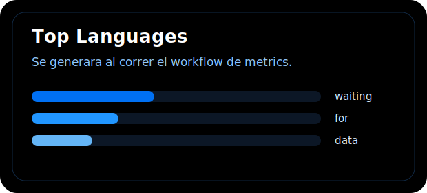

  <picture>
    <source media="(prefers-color-scheme: dark)" srcset="./banner-nextjs.svg" />
    <source media="(prefers-color-scheme: light)" srcset="./banner-nextjs-light.svg" />
    
  </picture>

<h3 align="center">Juan Pablo Velez</h3>

<em>Full Stack Developer · Next.js · React · TypeScript · Tailwind CSS</em>

---

## 🛠 Tech Stack

  
  
  
  

---

## 📊 GitHub Metrics

  <picture>
    <source media="(prefers-color-scheme: dark)" srcset="./github-metrics.svg" />
    <source media="(prefers-color-scheme: light)" srcset="./github-metrics-light.svg" />
    
  </picture>

---

## 📈 Lenguajes más usados

  <picture>
    <source media="(prefers-color-scheme: dark)" srcset="./github-languages.svg" />
    <source media="(prefers-color-scheme: light)" srcset="./github-languages-light.svg" />
    
  </picture>

