  <picture>
    <source media="(prefers-color-scheme: dark)" srcset="./banner-nextjs.svg?v=20260414-1" />
    <source media="(prefers-color-scheme: light)" srcset="./banner-nextjs-light.svg?v=20260414-1" />
    
  </picture>

## **Juan Pablo Velez**
**Full Stack Developer | Next.js | React | TypeScript**

I am a **Full Stack Developer** focused on building **modern, scalable, and maintainable web applications** with special attention to **frontend experience, clean architecture, and solid implementation details**.

I enjoy working with **Next.js, React, TypeScript, and Tailwind CSS**, creating products that balance **performance, clarity, and visual quality**.

Here you will find projects that reflect my **curiosity**, **discipline**, and my commitment to **continuous improvement** as a developer.

---

### Tech Stack & Expertise

**Core Stack**

  
  
  
  

**What I Focus On**

- Building fast and maintainable interfaces with Next.js and React.
- Writing scalable frontend code with TypeScript.
- Creating clean and responsive UI systems with Tailwind CSS.
- Improving product quality through consistency, clarity, and iteration.

---

### GitHub Metrics

  <picture>
    <source media="(prefers-color-scheme: dark)" srcset="./github-metrics.svg" />
    <source media="(prefers-color-scheme: light)" srcset="./github-metrics-light.svg" />
    
  </picture>

